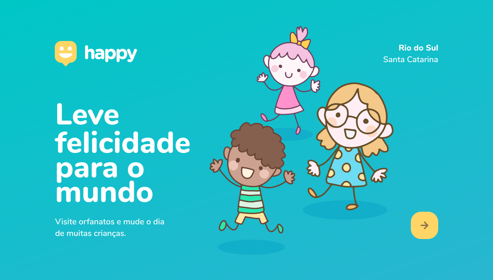

<h1 align="center">
     
        
      
        Happy 
</h1>

    

        Happy é um projeto desenvolvido durante 3º edição da Next Level Week, nessa semana criamos uma aplicação Web com o intuito de conectar pessoas e as incentivar a visitar orfanatos. Feito com HTML, CSS e Javascript.
          
        Happy is a project developed during the 3rd edition of Next Level Week, this week we created a Web application in order to connect people and encourage them to visit orphanages. Made with HTML, CSS and Javascript.
    

  

    
    
  

## Features

Coming soon

## Explored and implemented concepts

Coming soon
<!-- - [ ] Basic concepts about HTML, CSS and JS -->
## Getting started

Coming soon

<!-- As this is an introductory project, there is no installation tutorial. Just open and enjoy. -->

## License

Released in 2020. This project is under the MIT license.
Made with care and love by Yuri Oliveira 🚀.
