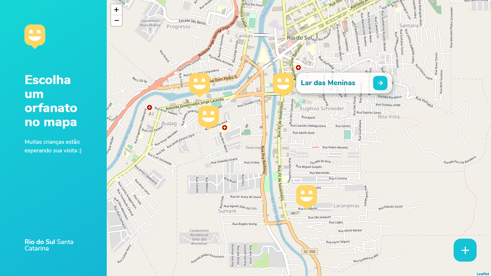
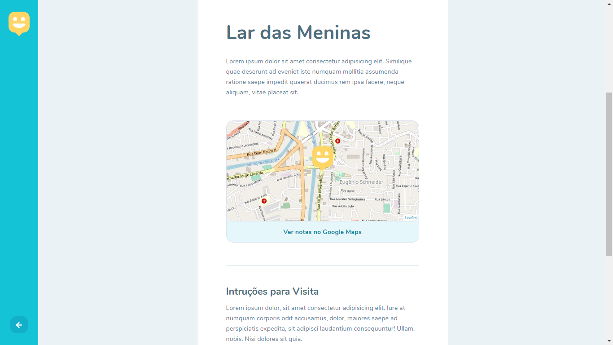

<h1 align="center">
    <br>
        
    <br><br>
        Happy 
</h1>

<div>
    <p align="center">
        Happy é um projeto desenvolvido durante 3º edição da Next Level Week, nessa semana criamos uma aplicação Web com o intuito de conectar pessoas e as incentivar a visitar orfanatos. Feito com HTML, CSS e Javascript.
        <br><br>
        Happy is a project developed during the 3rd edition of Next Level Week, this week we created a Web application in order to connect people and encourage them to visit orphanages. Made with HTML, CSS and Javascript.
    </p>
</div>
<p align="center">
    
    
</p>

<div>

  <p align="center">
    <a href="https://www.linkedin.com/in/yuri-silva99/" target="_blank">
        
    </a>
    <a href="#">
        
    </a>
    <a href="#">
        
    </a>
  </p>

</div>

## Features

- 🏬 Find orphanages
- 🏫 Register orphanages
- 🏠 Help give children a new home 😄

## Explored and implemented concepts

- [X] Reinforcing teachings of HTML, CSS and JS
- [X] Creating a landing page
- [X] Using the Leaflet Map
- [X] Reinforcing concepts about SQL
- [X] Using SQLite

## Installation

<b>You need to install <a href="https://nodejs.org/en/download/">Node.JS</a> first, then run this command:</b>
``` 
git clone https://github.com/Yuri-stack/NLW3_Happy.git
```

<b>Install dependencies</b>

```
npm install
```

<b>Recommendations</b>

<ul>
    <li>It is recommended that you have installed Google Chrome</li>
    <li>I recommend using VSCode as a development IDE</li>
</ul>

## Getting started

Coming soon
<!-- As this is an introductory project, there is no installation tutorial. Just open and enjoy. -->

## License

Released in 2020. This project is under the MIT license.
Made with care and love by Yuri Oliveira 🚀.
